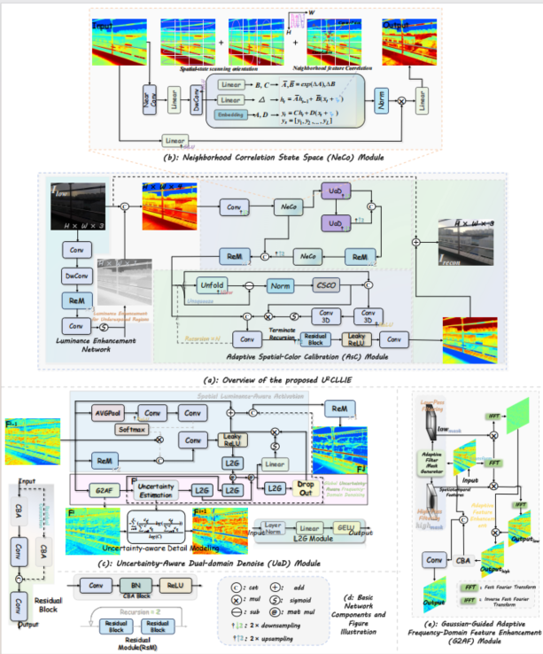
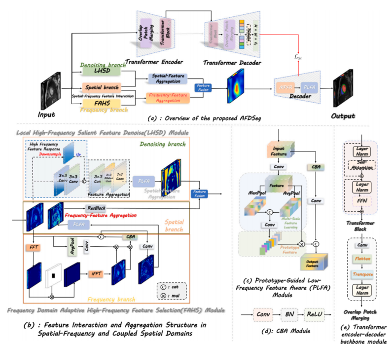
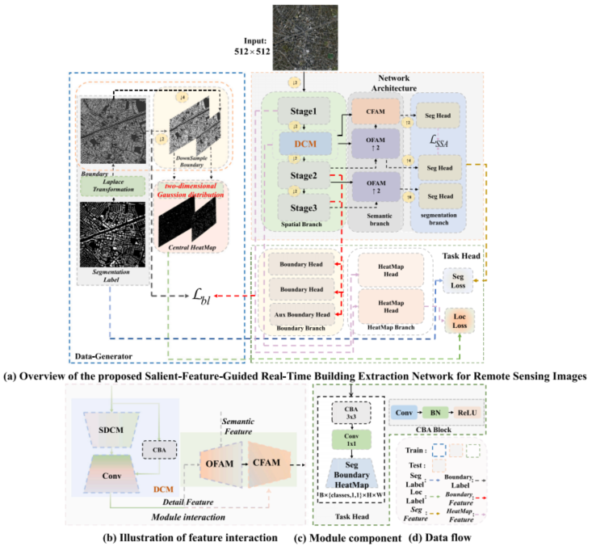
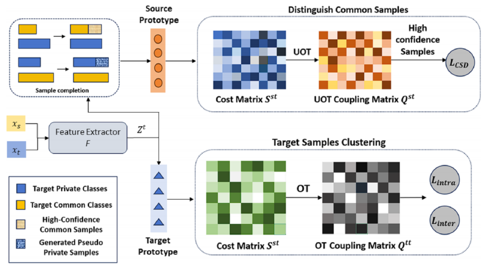
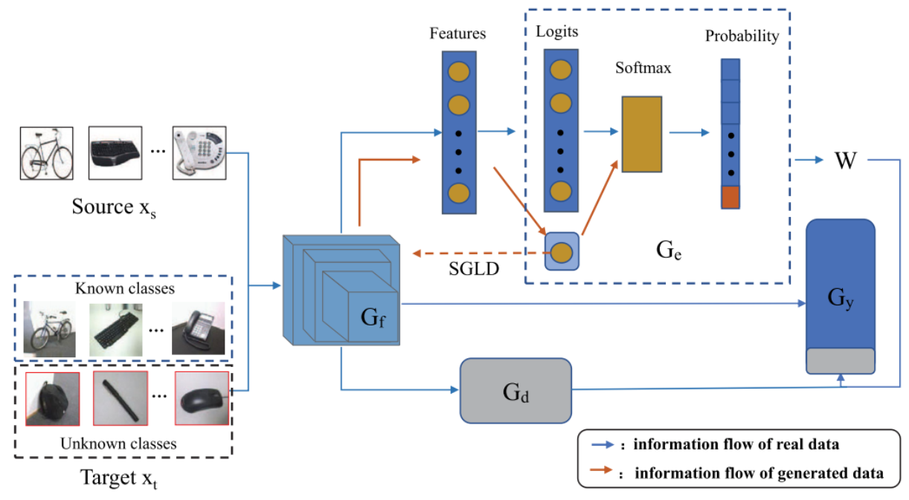
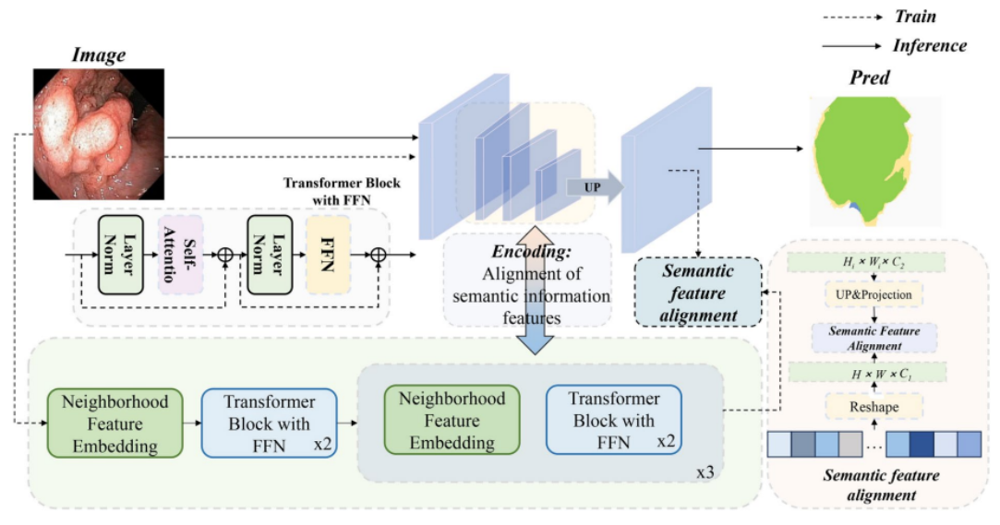

#  &#x1F393; Introduction
刘东是湘南学院计算机与人工智能学院教授，佛山大学兼职硕士生导师。博士毕业于吉林大学计算机科学与技术学院，是澳大利亚国立大学的联合培养博士。目前担任湘南学院计算机与人工智能学院副院长，先进嵌入式计算技术与智能医疗系统湖南省工程研究中心副主任。研究方向为计算机视觉，医学图像分析，遥感图像处理，底层视觉图像增强。主持或参与国家自然科学基金，湖南省自科基金、湖南省社科基金等科研项目10余项。以第一作者/通信作者发表SCI/EI等学术论文30余篇（其中近两年在国际顶级会议/期刊 (CCF A/B/C，中科院1区/2区)以第一作者/通信作者发表论文9篇），授权中国发明专利3项。主持湖南省课程思政示范课程1门，湖南省大学生创新创业课程1门。指导学生获国家级省级学科奖励50余项，多次获评“优秀指导老师”奖。

Dong Liu is a Professor at the School of Computer Science and Artificial Intelligence, Xiangnan University, and a part-time Master’s supervisor at Foshan University. He received his Ph.D. from the College of Computer Science and Technology, Jilin University, and completed a joint doctoral training program at the Australian National University. He currently serves as Associate Dean of the School of Computer Science and Artificial Intelligence at Xiangnan University and as Deputy Director of the Hunan Provincial Engineering Research Center for Advanced Embedded Computing Technology and Intelligent Medical Systems. His research interests include computer vision, medical image analysis, remote sensing image processing, and low-level image enhancement. He has led or participated in more than ten research projects supported by the National Natural Science Foundation of China, the Hunan Provincial Natural Science Foundation, the Hunan Provincial Social Science Foundation, and other provincial-level programs. Over the past years, he has published more than 30 academic papers indexed by SCI/EI as the first or corresponding author, including nine papers in top international conferences and journals (CCF A/B/C; CAS Zones 1/2) within the last two years. He holds three authorized Chinese invention patents. He has led one provincial “Curriculum Ideology and Politics” demonstration course and one provincial undergraduate innovation and entrepreneurship course. He has supervised students who have won more than 50 national and provincial awards and has been repeatedly recognized as an “Excellent Advisor.”

For collaborations or inquiries, please feel free to contact me via email.

#  &#128227; News
- *06/2025*: &nbsp;  &#127881; &#127881; One paper about Segmentation (*Fourier-Based Learning for Medical Image Segmentation*) accepted to ***KBS***.
- *05/2025*: &nbsp;  &#127881; &#127881; One paper about Segmentation (*Ultra-lightweight Semantic Segmentation for Remote Sensing Imagery*) accepted to ***KBS***.
- *04/2025*: &nbsp;  &#127881; &#127881; One paper about Segmentation (*; Open-Set Domain Adpation*) accepted to ***Complex \&  Intelligent Systems***.
- *12/2024*: &nbsp;  &#127881; &#127881; One paper about Domain Adapation (*Prototype optimal transport*) accepted to ***Complex \&  Intelligent Systems***.
- *09/2024*: &nbsp;  &#127881; &#127881; One paper about Medical Segmentation (*colonoscopic polyp segmentation*) accepted to ***Scientific Reports***.

#  &#128218; Selected Publications
\* and † denote a corresponding author and an equal-contribution author, respectively.

Arxiv 2025

*Uncertainty-Aware Spatial Color Correlation for Low-Light Image Enhancement* [[PDF]](https://www.arxiv.org/abs/2508.04176) [[Code]](https://github.com/promisedong/U2CLLIE)

**Jin Kuang**, Dong Liu*, Yukuang Zhang, Shengsheng Wang

KBS 2025

*Adaptive frequency-domain enhanced deep model driven by heterogeneous networks for medical image segmentation* [[PDF]](https://www.sciencedirect.com/science/article/abs/pii/S0950705125006458) [[Code]](https://github.com/promisedong/AFDSeg)

**Dong Liu**, Jin Kuang*,†

KBS 2025

*SFGNet: Salient-feature-guided real-time building extraction network for remote sensing images* [[PDF]](https://www.sciencedirect.com/science/article/abs/pii/S0950705125004605) [[Code]](https://github.com/promisedong/SFGNet)

**Jin Kuang**, Dong Liu*

Complex & Intelligent Systems 2025

*Sample-Prototype Optimal Transport-Based Universal Domain Adaptation for Remote Sensing Image Classification* [[PDF]](https://link.springer.com/article/10.1007/s40747-024-01747-y) [[Code]](https://github.com/promisedong/)

Xiaosong Chen, Yongso Yang, Dong Liu*, Shengsheng Wang

Complex & Intelligent Systems 2025

*Energy-based Open Set Domain Adaptation with Dynamic Weighted Synergistic Mechanism* [[PDF]](https://link.springer.com/article/10.1007/s40747-025-01857-1) [[Code]](https://github.com/promisedong/)

Zihao Fu, Dong Liu*, Shengsheng Wang, Hao Chai.

Scientific Reports 2024

*NA-segformer: A multi-level transformer model based on neighborhood attention for colonoscopic polyp segmentation* [[PDF]](https://link.springer.com/article/10.1007/s40747-025-01857-1) [[Code]](https://github.com/promisedong/)

**Dong Liu**, Chao Lu, Haonan Sun, Shoupin Gao*

<!-- 为后续论文添加完整的paper-box结构 -->

*Lenke classification of scoliosis based on segmentation network and adaptive shape descriptor (Applied Sciences-Basel 2023)*

**Dong Liu**, Lingrong Zhang, Jinglin Yang, Anping Lin*

*Anomaly Detection in Chest X-Rays Based on Dual Attention Mechanism and Multi-Scale Feature Fusion (Symmetry-Basel 2023)*

**Dong Liu**, Shuzhen Lu, Lingrong Zhang, Yaohui Liu*

*Heterogeneous differential evolution particle swarm optimization with local search (Complex & Intelligent Systems 2023)*

**Anping Lin**, Dong Liu*, Zhongqi Li, *et al*

*An Attention-Based Uncertainty Revising Network with Multi-Loss for Environmental Microorganism Segmentation (Electronics 2023)*

**Hengyuan Na**, Dong Liu*, Shengsheng Wang

*On nonlinear fractional Choquard equation with indefinite potential and general nonlinearity (Boundary Value Problems 2023)*

**Fangfang Liao**, Fulai Chen, Shifeng Geng, Dong Liu*

*基于空间自适应和混合损失对抗网络的乳腺肿块图像分割方法 (云南大学学报 2022)*

**刘东**, 陈境宇, 王生生*

*基于空间自适应和混合损失对抗网络的乳腺肿块图像分割方法 (重庆大学学报 2021)*

**刘东**，王生生*

# &#x1F4D6; Selected Patents
- **发明专利:**  一种中耳炎医学影像处理方法及系统 (ZL202410985032.5) **刘东**，高守平，雷冠雄
- **发明专利:** 一种脊柱侧弯Lenke分型系统 (ZL202211507294.8) **刘东**，张灵荣，杨景麟
- **实用新型:** 一种基于计算机视觉的元件缺陷检测装置 (ZL202123168909.2) **刘东**
- **软件著作权:** 基于计算机视觉的零部件表面缺陷检测系统 (2022SR1000030) **刘东**
- **软件著作权:** 基于计算机视觉的脊柱侧弯辅助诊断系统 (2022SR0275464) **刘东**，张灵荣，杨景麟

#  &#128269; Professional Service
- 湖南省人工智能学会理事
- 湖南省计算机学会理事
- 湖南省高等教育学会计算机教育专委会理事
- AAAI Conference on Artificial Intelligence (AAAI)
- IEEE Transactions on Geoscience and Remote Sensing (TGRS)
- Knowledge-Based Systems (KBS)
- Complex \& Intelligent Systems

# &#x1F3C6; Professional Honors
- 2024年湖南省普通高校青年教师教学竞赛二等奖
- 2024年湖南省计算机学会优秀教学成果三等奖
- 2023年湖南省普通高校课程思政教学竞赛二等奖
- 2023年湖南省青年骨干教师
- 2023年“挑战杯”湖南省大学生课外学术作品竞赛“优秀指导老师奖”
- 2023年湖南省大学生智能导航科技创新大赛“优秀指导老师奖”
- 2023年湖南省大学生程序设计竞赛“优秀指导老师奖”
- 2021年湖南省大学生物联网创新设计竞赛“优秀指导老师奖”

# &#x1F4DD; Courses Taught
- 湖南省课程思政示范课程：《人工智能》
- 湖南省大学生创新创业精品课程：《人工智能（实训）》
- 《人工智能导论》

# &#x1F31F; Student Awards
- 2024年“挑战杯”全国大学生创业计划竞赛全国总决赛铜奖，省级金奖
- 2023年“挑战杯”全国大学生课外学术科技作品竞赛主赛道国家级三等奖，省级金奖
- 2023年“中国软件杯”大学生软件设计大赛国家级三等奖
- 2023年湖南省大学生智能导航科技创新大赛一等奖
- 2023年湖南省大学生计算机程序设计竞赛一等奖
- 2021年湖南省大学生物联网应用创新设计大赛一等奖
- 2023年湖南省“互联网+”大学生创新创业大赛二等奖
- 2022年湖南省“互联网+”大学生创新创业大赛二等奖
- 2023“挑战杯”湖南省大学生课外学术科技作品竞赛二等奖
- 2024年湖南省智能导航科技创新大赛二等奖
- 2024年湖南省大学生程序设计大赛二等奖
- 2023年湖南省大学生物联网应用创新设计竞赛二等奖
- 2021年湖南省大学生智能导航科技创新大赛二等奖
- 2020湖南省医学技能创新创业大赛一等奖
- 2019年“中国软件杯”大学生软件设计大赛国家级三等奖
